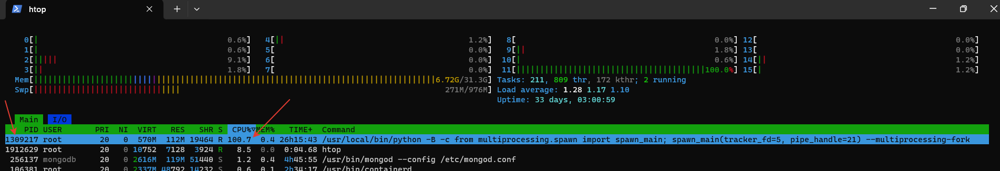

## Алгоритм действий:
1. Запустить процесс, у которого мы хотим узнать причину утечки ресурсов (это может быть контейнер в композе)
    
2. Сбилдить образ и запустить его в привилегированном режиме
    ```shell
    docker build -t my-custom-flame .
    docker run -it --rm --privileged --pid host -v ${PWD}:/out -v /etc/localtime:/etc/localtime:ro --pid host -v /sys/kernel/debug:/sys/kernel/debug -v /sys/fs/cgroup:/sys/fs/cgroup -v /sys/fs/bpf:/sys/fs/bpf --net host my-custom-flame
    ```
3. Внутри контейнера запустить команду (`-p 1309217` - PID проблемного процесса):
    ```shell
    /usr/share/bcc/tools/profile -dF 99 -f 15 -p 1309217 | ./work/FlameGraph/flamegraph.pl > /out/perf.svg
    ```
